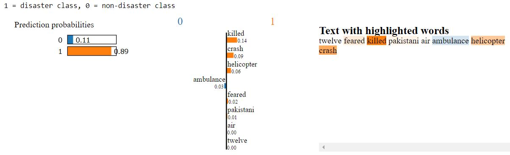
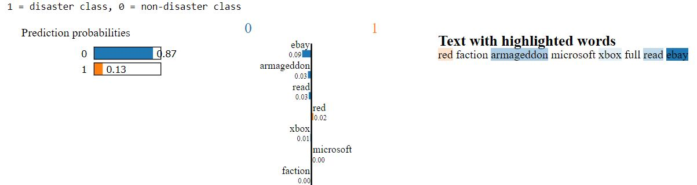
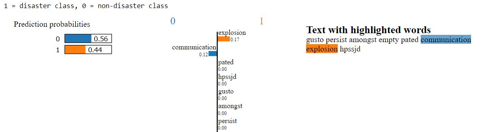
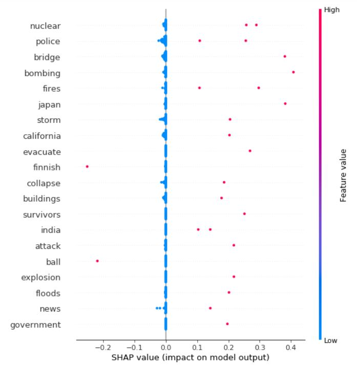
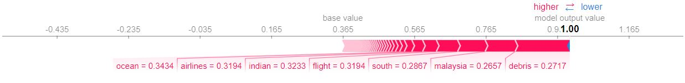

# Interpretability Data Visualisations
## LIME Explainer Results

### Correct disaster Tweet prediction example

### Correct non-disaster Tweet prediction example

### Incorrect non-disaster Tweet prediction example

---

## SHAP Explainer Results

### Global feature importance summary plot

### Local feature importance force plot for Disaster prediction

---

